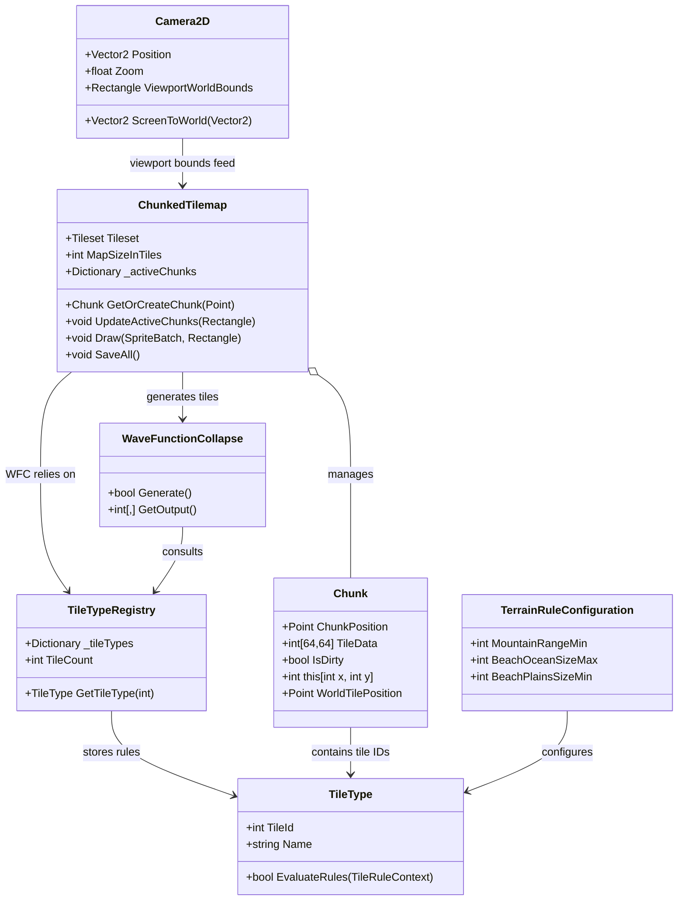

# Architecture Class Diagram

The diagram below names the key concepts (Map, Chunk, Tile, rules) and their relationships. Export to PNG by opening in a Mermaid-aware editor and selecting export, or run `mmdc -i architecture-class-diagram.md -o architecture-class-diagram.png` if you have mermaid-cli.

