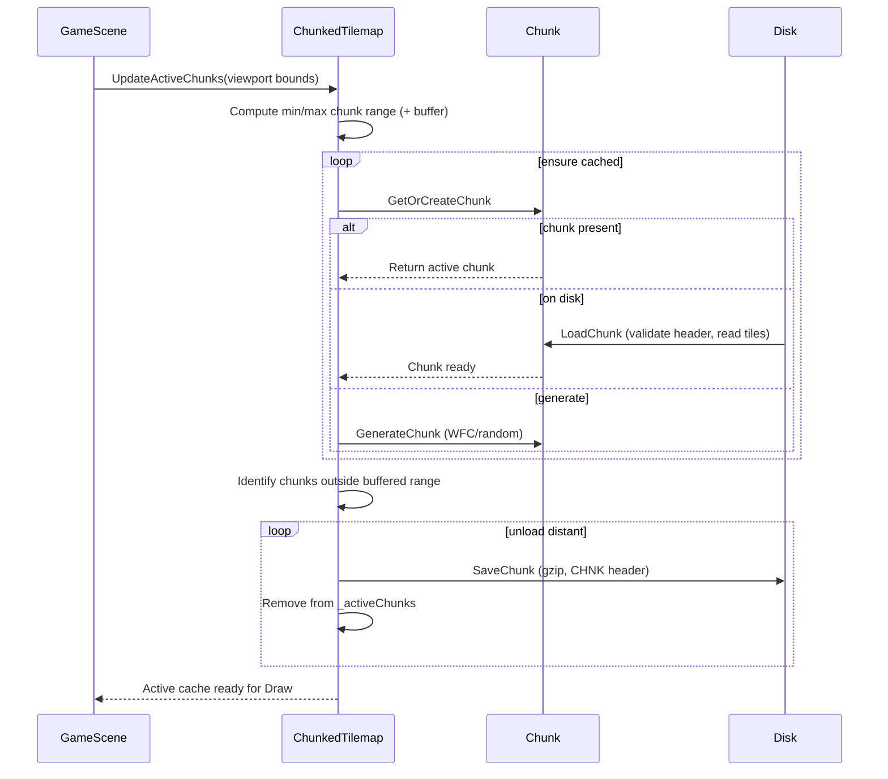

# Chunk Cache and Load Sequence Diagram

Render this Mermaid diagram in your preferred viewer (e.g., mermaid.live) and export to PNG via the UI or mermaid-cli (`mmdc -i chunk-cache-sequence.md -o chunk-cache-sequence.png`).

