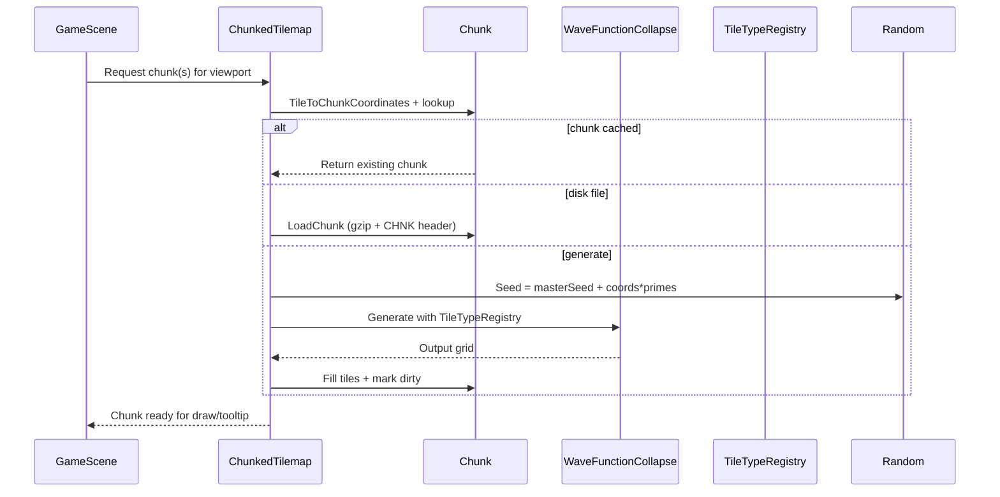

# Map Generation Sequence Diagram

Use a Mermaid-capable renderer (VS Code Mermaid Preview, mermaid.live, or mermaid-cli) to render and export this diagram as PNG.

```mermaid
sequenceDiagram
    participant GameScene
    participant ChunkedTilemap
    participant Chunk
    participant WaveFunctionCollapse
    participant TileTypeRegistry
    participant Random

    GameScene->>ChunkedTilemap: Request chunk(s) for viewport
    ChunkedTilemap->>Chunk: TileToChunkCoordinates + lookup
    alt chunk cached
        Chunk-->>ChunkedTilemap: Return existing chunk
    else disk file
        ChunkedTilemap->>Chunk: LoadChunk (gzip + CHNK header)
    else generate
        ChunkedTilemap->>Random: Seed = masterSeed + coords*primes
        ChunkedTilemap->>WaveFunctionCollapse: Generate with TileTypeRegistry
        WaveFunctionCollapse-->>ChunkedTilemap: Output grid
        ChunkedTilemap->>Chunk: Fill tiles + mark dirty
    end
    ChunkedTilemap-->>GameScene: Chunk ready for draw/tooltip
```