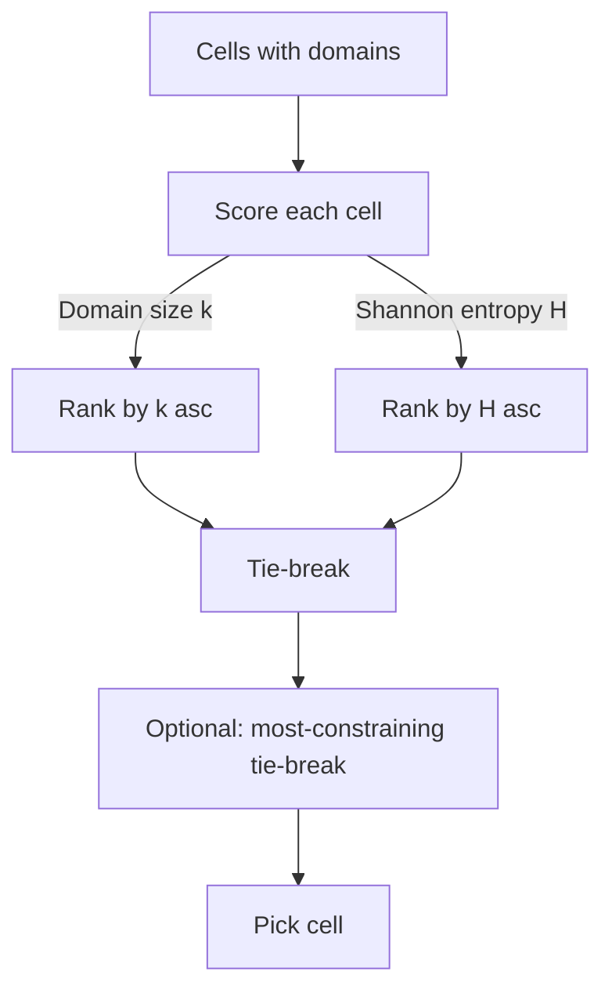
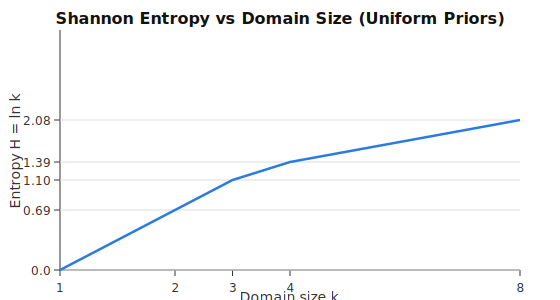

# Entropy & Selection Heuristics

> See also
>
> - Roadmap: deeper context and tuning tips in [wfc-implementation-roadmap.md](../../wfc/wfc-implementation-roadmap.md)
> - Backtracking: candidate ordering and rollback in [04-backtracking.md](04-backtracking.md)

Purpose: describe how the solver chooses the next cell to collapse and which tile to place, and how to tune those decisions for stability, determinism, and aesthetics.

## Entropy & Cell Selection

- Lowest-entropy selection: pick the cell with the smallest domain (fewest candidates). This prioritizes constrained areas and reduces branching.
- Shannon entropy option: compute $H = -\sum p_i \log p_i$ using tile priors for richer selection. Cells with higher information gain can be prioritized.
- Most Constrained + Most Constraining: after selecting the most constrained cell, prefer ones that impact many neighbors (e.g., near boundaries) to stabilize propagation.
- Tie-breaking:
  - Runtime: break equal-entropy ties via the injected randomness provider; see [WfcProvider.cs](../../../TerrainGeneration2D.Core/Mapping/WaveFunctionCollapse/WfcProvider.cs).
  - Deterministic tests: inject a deterministic provider to ensure reproducible tie-breaking.
  - Current flags (runtime-configurable):
    - `Heuristics.UseMostConstrainingTieBreak`: prefer cells that influence more undecided neighbors.
    - `Heuristics.ApplyInfluenceTieBreakForSingleHeuristic`: also apply the influence tie-break when only one heuristic is enabled.
    - `Heuristics.PreferCentralCellTieBreak`: favor cells closer to the grid center when ties remain.
    - `Heuristics.UniformPickFraction`: blend uniform vs. weighted tile selection during collapse (non-backtracking).
    - `Heuristics.MostConstrainingBias`: soft bias strength for influence-based tie-break (weighted pick among tied cells).

### Shannon Entropy vs. Domain Size

Two common ways to score “which cell to pick next”:

- Domain size (current default): minimize the number of candidates $k = |\mathcal{D}|$.
- Shannon entropy: $H = -\sum_i p_i \log p_i$ where $p_i$ is the probability of candidate $i$.

Key differences and when they matter:

- If $p_i$ is uniform ($p_i = 1/k$), then $H = \log k$, which is monotonic with $k$. In that case, both methods rank cells the same, so there’s no practical difference beyond the cost of computing logs.
- Shannon entropy shines when you have informative, non-uniform priors (or contextual weights) over candidates. A cell with more candidates but a sharply peaked distribution (one candidate is much more likely) can have lower $H$ than a cell with fewer but evenly likely candidates. This often stabilizes propagation by collapsing “obvious” cells earlier.

How to choose $p_i$ in practice:

- Uniform: $p_i = 1/k$ (simple, cheap; equivalent ordering to domain size).
- Weighted-by-context: derive per-candidate weights $w_i$ from your heuristics (e.g., neighbor matches, biome/height compatibility, global frequency shaping), then set $p_i = w_i/\sum_j w_j$.
- Global priors: maintain historical frequencies to discourage overused tiles; blend them with local weights, e.g., $w_i = \alpha \cdot w^{local}_i + (1-\alpha) \cdot w^{global}_i$.

Implementation tips:

- Use natural logs ($\ln$) or base-2 ($\log_2$); both are equivalent for ordering. Cache/log-lookup if you compute entropy frequently.
- Guard against zeros: clamp with a small $\epsilon$ when converting weights to probabilities.
- Most-constraining tie-break: if two cells have similar $H$, prefer the one that influences more neighbors (e.g., interior/border proximity) to reduce branching.
- Determinism: after computing a shortlist, break ties via `IRandomProvider` and stabilize iteration order.

Sketch (weighted entropy):

```csharp
double Entropy(HashSet<int> domain, Func<int,int> weight)
{
  if (domain == null || domain.Count <= 1) return 0.0; // settled or singleton
  var weights = domain.Select(t => Math.Max(1, weight(t))).ToArray();
  var sum = (double)weights.Sum();
  double h = 0.0;
  foreach (var w in weights)
  {
    var p = w / sum; // 0 < p <= 1
    h -= p * Math.Log(p); // natural log
  }
  return h;
}
```

Configuration suggestion:

- Heuristics.UseShannonEntropy: `true|false`
- Heuristics.UniformPickFraction: `0..1` (blend uniform with weighted)
- Heuristics.MostConstrainingBias: `0..1` (soft influence bias over tied cells)
- See runtime config doc: [12-config-wfc-weights.md](../../terrain2d-tutorial/12-config-wfc-weights.md)

## What's Still To Implement (Heuristics)

Optional enhancements:

- Global priors/frequency shaping: maintain global tile usage priors and blend with local weights for Shannon entropy (`p_i`), to discourage overuse and improve variety.
- Multi-heuristic composition: allow a weighted combination of domain-size and Shannon scores (e.g., `score = a·k + b·H`) instead of the current intersect/union shortlist logic.
- Positional biases: optional perimeter/interior bias in tie-breaks (beyond `PreferCentralCellTieBreak`) to guide the collapse front spatially.
- Expanded diagnostics: add counters for per-stage shortlist sizes and heuristic paths if deeper visibility is needed.

### Visual Aids

Monotonicity (uniform priors): when $p_i=1/k$, Shannon entropy is $H=\log k$ and ranks cells identically to domain size.

| k (domain size) | $H=\ln k$ | $H=\log_2 k$ |
|---:|---:|---:|
| 1 | 0.000 | 0.000 |
| 2 | 0.693 | 1.000 |
| 3 | 1.099 | 1.585 |
| 4 | 1.386 | 2.000 |
| 8 | 2.079 | 3.000 |

Flow of cell selection (two scoring options):



Weighted vs. uniform priors (example probabilities and entropy):

```
Domain candidates: {A, B, C}
Weights (contextual): {8, 1, 1}
Probabilities: p(A)=0.8, p(B)=0.1, p(C)=0.1

Bars
A | ########
B | #
C | #

Entropy (natural log):
H ≈ - (0.8 ln 0.8 + 0.1 ln 0.1 + 0.1 ln 0.1) ≈ 0.639
Uniform baseline (k=3): H = ln 3 ≈ 1.099
⇒ Weighted priors reduce H vs. uniform, making this cell a stronger candidate.
```

Rendered diagrams (for non-Mermaid renderers):




### Sample: Lowest-Entropy Selection and Tie-Breaking
Project: TerrainGeneration2D.Core, file: [WfcProvider.cs](../../../TerrainGeneration2D.Core/Mapping/WaveFunctionCollapse/WfcProvider.cs)

```csharp
// Picks the cell with the smallest domain (fewest candidates).
// Breaks ties using the injected IRandomProvider for stability.
private (int x, int y) FindLowestEntropy()
{
  var minEntropy = int.MaxValue;
  List<(int x, int y)> candidates = new();

  for (var y = 0; y < _height; y++)
  {
    for (var x = 0; x < _width; x++)
    {
      var poss = _possibilities[x, y];
      if (poss == null || poss.Count <= 1)
        continue;

      var entropy = poss.Count;
      if (entropy < minEntropy)
      {
        minEntropy = entropy;
        candidates.Clear();
        candidates.Add((x, y));
      }
      else if (entropy == minEntropy)
      {
        candidates.Add((x, y));
      }
    }
  }

  if (candidates.Count == 0)
    return (-1, -1);

  // Tie-break: deterministic in tests via IRandomProvider implementation
  return candidates[_random.NextInt(candidates.Count)];
}
```

## Tile Choice & Weight Strategies

- Neighbor-match boost (current): increase weight for tiles matching already-collapsed neighbors. Example formula: `weight = Base + Multiplier * matches`; defaults are conservative (e.g., Base=1, Multiplier=3).
- Deterministic ordering: sort candidates by weight descending, then tile id ascending. This keeps backtracking exploration stable.
- Context-aware weights: include heightmap/biome signals or global frequency caps to avoid overuse of certain tiles.
- Mixed strategies: combine heuristic and uniform randomness (e.g., 80/20) via `NextDouble()` to retain variation.
 - Backtracking linkage: this ordering is consumed by the decision frames in backtracking to explore candidates deterministically; see [04 — Backtracking](04-backtracking.md).

### Sample: Weighted Collapse (Non-Backtracking)
Project: TerrainGeneration2D.Core, file: [WfcProvider.cs](../../../TerrainGeneration2D.Core/Mapping/WaveFunctionCollapse/WfcProvider.cs)

```csharp
// Compute neighbor-match boost and perform a weighted roll
private bool CollapseCell(int x, int y)
{
  var poss = _possibilities[x, y];
  if (poss == null || poss.Count == 0)
    return false;

  var neighbors = new List<int>();
  if (y > 0 && _output[x, y - 1] != -1) neighbors.Add(_output[x, y - 1]);
  if (y < _height - 1 && _output[x, y + 1] != -1) neighbors.Add(_output[x, y + 1]);
  if (x > 0 && _output[x - 1, y] != -1) neighbors.Add(_output[x - 1, y]);
  if (x < _width - 1 && _output[x + 1, y] != -1) neighbors.Add(_output[x + 1, y]);

  var options = poss
    .Select(tile => new { Tile = tile, Weight = 1 + neighbors.Count(n => n == tile) * 3 })
    .OrderBy(o => o.Tile) // stabilize iteration order
    .ToList();

  var total = options.Sum(o => o.Weight);
  var roll = _random.NextInt(total);

  var cumulative = 0;
  var chosen = options.First().Tile;
  foreach (var o in options)
  {
    cumulative += o.Weight;
    if (roll < cumulative) { chosen = o.Tile; break; }
  }

  _output[x, y] = chosen;
  _possibilities[x, y] = null;
  return true;
}
```

### Sample: Candidate Ordering (Backtracking)
Project: TerrainGeneration2D.Core, file: [WfcProvider.cs](../../../TerrainGeneration2D.Core/Mapping/WaveFunctionCollapse/WfcProvider.cs)

```csharp
// Order candidates by weight desc, then tile id asc for deterministic exploration
var weighted = poss.Select(tile => new { Tile = tile, Weight = 1 + neighbors.Count(n => n == tile) * 3 }).ToList();
var ordered = weighted
  .OrderByDescending(w => w.Weight)
  .ThenBy(w => w.Tile)
  .Select(w => w.Tile)
  .ToArray();

// Decision frame captures ordered candidates and change-log mark
var frame = new DecisionFrame { X = x, Y = y, Candidates = ordered, NextIndex = 0, ChangesMark = log.Mark(), Depth = stack.Count + 1 };
stack.Push(frame);
```

## Determinism & Randomness Provider

- Abstraction: `IRandomProvider` decouples randomness from the algorithm. See [RandomProvider.cs](../../../TerrainGeneration2D.Core/Mapping/WaveFunctionCollapse/RandomProvider.cs).
- Adapter: `RandomAdapter` wraps `System.Random` for runtime.
- Tests: implement a deterministic provider that returns fixed values to make choices predictable. Example in [TerrainGeneration2D.Tests/MappingTests.cs](../../../TerrainGeneration2D.Tests/MappingTests.cs).

### Sample: Deterministic Provider and Injection
Project: TerrainGeneration2D.Tests, file: [MappingTests.cs](../../../TerrainGeneration2D.Tests/MappingTests.cs)

```csharp
// Deterministic IRandomProvider for reproducible choices in tests
private sealed class DeterministicRandomProvider : IRandomProvider
{
  public int NextInt() => 0;
  public int NextInt(int maxValue) => 0;
  public int NextInt(int minValue, int maxValue) => minValue;
  public double NextDouble() => 0.0;
}

// Inject into WfcProvider for deterministic tie-breaks and selection
var wfc = new WfcProvider(8, 8, registry, new DeterministicRandomProvider(), new TerrainRuleConfiguration(), DefaultHeightProvider.Instance, chunkOrigin);
var success = wfc.Generate(enableBacktracking: true, maxIterations: 10000, maxBacktrackSteps: 4096, maxDepth: 256);
```

### Sample: Mixed Strategy (Heuristic + Uniform)
Project: TerrainGeneration2D.Core, file: [WfcProvider.cs](../../../TerrainGeneration2D.Core/Mapping/WaveFunctionCollapse/WfcProvider.cs)

```csharp
// Blend heuristic weighting with uniform randomness to retain variation
// Example: 20% uniform, 80% weighted
int ChooseTile(List<(int tile, int weight)> weightedOptions)
{
  if (_random.NextDouble() < 0.20)
  {
    // Uniform pick among candidates
    var idx = _random.NextInt(weightedOptions.Count);
    return weightedOptions[idx].tile;
  }

  // Weighted pick
  var total = weightedOptions.Sum(o => o.weight);
  var roll = _random.NextInt(total);
  var acc = 0;
  foreach (var (tile, weight) in weightedOptions)
  {
    acc += weight;
    if (roll < acc) return tile;
  }
  return weightedOptions[0].tile; // fallback
}
```

## WfcProvider Notes

- Entropy selection: lowest domain size; ties resolved via `IRandomProvider`.
- Non-backtracking collapse: weighted roll using neighbor-match boost; candidate list sorted by tile id to avoid HashSet nondeterminism.
- Backtracking: candidates ordered by weight desc, then tile id asc; changes recorded via `ChangeLog` to support rollback.
- Files: [WfcProvider.cs](../../../TerrainGeneration2D.Core/Mapping/WaveFunctionCollapse/WfcProvider.cs), [ChangeLog.cs](../../../TerrainGeneration2D.Core/Mapping/WaveFunctionCollapse/ChangeLog.cs).

## Diagnostics

- Use `TerrainPerformanceEventSource` to track WFC phases and stats: decisions, contradictions, backtracks, max depth.
- Validate heuristic changes by inspecting `WfcStats` and toggling the debug overlay.
- File: [TerrainPerformanceEventSource.cs](../../../TerrainGeneration2D.Core/Diagnostics/TerrainPerformanceEventSource.cs).

## Integration

- Runtime: `ChunkedTilemap` constructs `WfcProvider` per chunk; backtracking enabled with sane limits. See [ChunkedTilemap.cs](../../../TerrainGeneration2D.Core/Graphics/ChunkedTilemap.cs).
- Tuning knobs: adjust backtracking limits alongside weight multipliers to balance performance and stability.

## Try It

- Deterministic unit tests:
  - Implement a test `IRandomProvider` that returns fixed values and pass it to `WfcProvider` to make collapse/backtracking reproducible.
  - Assert contradictions and rollbacks deterministically.
- Runtime config idea (optional):
  - Add `WfcWeights` to appsettings (e.g., `Base`, `NeighborMatchBoost`) and thread values into `WfcProvider` to scale the weight formula.
  - Start with small multipliers; monitor `WfcStats` for backtrack and depth changes.

## Implementation Notes

- Non-backtracking collapse: uses neighbor-match weighted selection in [WfcProvider.cs](../../../TerrainGeneration2D.Core/Mapping/WaveFunctionCollapse/WfcProvider.cs) and stabilizes candidate ordering with a tile-id sort to avoid HashSet nondeterminism.
- Backtracking loop: orders candidates by weight desc then tile id asc, captures them in `DecisionFrame`, and records reversible mutations via [ChangeLog.cs](../../../TerrainGeneration2D.Core/Mapping/WaveFunctionCollapse/ChangeLog.cs); contradictions trigger rollback and alternate candidate exploration.
- Randomness provider: `IRandomProvider` methods (`NextInt`, `NextDouble`) are consumed throughout selection; runtime uses [RandomAdapter](../../../TerrainGeneration2D.Core/Mapping/WaveFunctionCollapse/RandomProvider.cs), tests inject deterministic providers.
- Diagnostics: decision/contradiction/rollback events emitted via [TerrainPerformanceEventSource.cs](../../../TerrainGeneration2D.Core/Diagnostics/TerrainPerformanceEventSource.cs) help tune weights and backtracking limits.
- Integration: chunks construct `WfcProvider` per chunk and pass backtracking limits; see [ChunkedTilemap.cs](../../../TerrainGeneration2D.Core/Graphics/ChunkedTilemap.cs).

## Navigation
- Up: [WFC README](README.md)
- Previous: [04 — Backtracking](04-backtracking.md)
- Next: [05 — Integration](05-integration.md)
