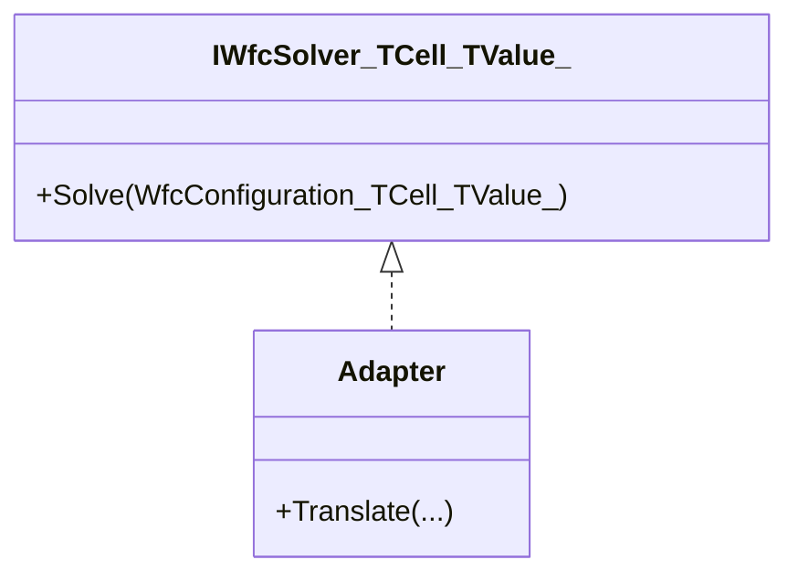

# Library Abstraction for Non-Tile Domains

## Overview

Abstract the WFC library to support non-tile domains, enabling procedural generation for a wide range of applications (e.g., building layouts, resource placement). Intended for teams needing WFC for domains beyond terrain tiles.

## Table of contents

- [Overview](#overview)
- [Feature requirements](#feature-requirements)
- [Feature status](#feature-status)
- [Definition of terms](#definition-of-terms)
- [Architectural considerations and constraints](#architectural-considerations-and-constraints)
- [Implementation guide](#implementation-guide)

## Feature requirements

## Feature status

- Not started

### Feature requirements

- (***COMPLETE***) Generic WFC solver interfaces support arbitrary cell/value types
  - GIVEN a need to support non-tile domains
  - WHEN the WFC solver is used for a new domain
  - THEN it must accept generic cell and value types

- (Incomplete) Decouple terrain-specific logic from WFC core
  - GIVEN the current WFC implementation
  - WHEN refactoring for generic support
  - THEN all terrain-specific logic is moved to adapters or shims

> Implementation not started. See Implementation guide Phase 1.

- (Incomplete) Support for custom rule and constraint systems
  - GIVEN a new domain with unique constraints
  - WHEN configuring the WFC solver
  - THEN custom rule and constraint systems can be injected or implemented

> Implementation not started. See Implementation guide Phase 2.

- (Incomplete) Maintain performance and determinism
  - GIVEN the generic WFC implementation
  - WHEN running on large or complex domains
  - THEN performance and determinism are not degraded compared to the legacy implementation

> Implementation not started. See Implementation guide Phase 4.

## Feature status

- Not started

## Definition of terms

| Term | Meaning | Reference |
| ---- | ------- | --------- |
| Domain | The set of possible values for a cell | |
| Adapter | A component that translates between generic and domain-specific logic | |

## Architectural considerations and constraints

- Backward compatibility for terrain generation
  - The generic WFC abstraction must preserve support for all existing terrain generation features and APIs.
  - Existing code using tile-based WFC (e.g., `WfcProvider`, `TileTypeRegistry`, `ChunkedTilemap`) should continue to work without modification.
  - Provide adapter classes or shims that map the legacy tile-based interfaces to the new generic interfaces.
  - Migration should be incremental: legacy and generic APIs can coexist, allowing gradual adoption.
  - All tests and benchmarks for terrain generation must pass after migration.
- Plugin system must support generic domains
- Test coverage for new abstractions



## Implementation guide

### Phase 1: Refactor WFC Core to Generics (Backward Compatibility Phase)

**Phase status:** Not started

#### Objective

Refactor WFC core to use generic types for cells and values, while preserving backward compatibility for all existing terrain generation code and APIs.

#### Technical details

- Change class and method signatures to use type parameters. Move terrain-specific logic to adapters.
- Provide adapter classes or shims that allow legacy tile-based APIs (e.g., WfcProvider, TileTypeRegistry) to work with the new generic core without modification.
- Ensure all existing terrain generation tests and benchmarks pass after migration.

#### Phase requirements

- (Incomplete) Refactor core to generics
  - GIVEN the current WFC core
  - WHEN refactoring begins
  - THEN all core types and methods use generics for cell/value

> Implementation not started. See technical details above.

- (Incomplete) Provide legacy adapters/shims
  - GIVEN legacy APIs (WfcProvider, TileTypeRegistry)
  - WHEN generic core is available
  - THEN adapters/shims allow legacy code to work unchanged

> Implementation not started. See technical details above.

- (Incomplete) Preserve test/benchmark coverage
  - GIVEN migration to generics
  - WHEN tests and benchmarks are run
  - THEN all legacy terrain tests/benchmarks pass

> Implementation not started. See technical details above.

#### Examples

```csharp
/// <summary>
/// Generic WFC solver interface for any constraint satisfaction domain.
/// </summary>
/// <typeparam name="TCell">Cell coordinate type (e.g., Point, Vector3)</typeparam>
/// <typeparam name="TValue">Value type placed in cells (e.g., int, enum)</typeparam>
public interface IWfcSolver<TCell, TValue>
{
    /// <summary>
    /// Solves the constraint satisfaction problem using WFC algorithm.
    /// </summary>
    /// <param name="config">Solver configuration and constraints</param>
    /// <returns>Solution if found; null if unsatisfiable within constraints</returns>
    WfcSolution<TCell, TValue>? Solve(WfcConfiguration<TCell, TValue> config);
}

/// <summary>
/// Adapter for legacy tile-based WFC API, preserving backward compatibility.
/// </summary>
public class LegacyTileWfcAdapter : IWfcSolver<(int x, int y), int>
{
    private readonly WfcProvider _legacyProvider;
    public LegacyTileWfcAdapter(WfcProvider legacyProvider) => _legacyProvider = legacyProvider;
    public WfcSolution<(int x, int y), int>? Solve(WfcConfiguration<(int x, int y), int> config)
    {
        // Bridge call to legacy provider
        var success = _legacyProvider.Generate();
        if (!success) return null;
        // Convert legacy output to generic solution
        // ...implementation omitted...
        return new WfcSolution<(int x, int y), int>();
    }
}
```

The following test demonstrates that legacy terrain generation continues to work after migration to the generic WFC core. It verifies that the adapter correctly bridges the legacy and generic APIs and that the output is still valid.

```csharp
/// <summary>
/// Test: Legacy terrain generation still works after migration.
/// </summary>
[Fact]
public void LegacyTerrainGeneration_ProducesSameOutput_AfterMigration()
{
    // Arrange: set up legacy provider and config
    var legacyProvider = new WfcProvider(/* ... legacy args ... */);
    var adapter = new LegacyTileWfcAdapter(legacyProvider);
    var config = new WfcConfiguration<(int x, int y), int> { /* ... */ };
    // Act
    var solution = adapter.Solve(config);
    // Assert
    Assert.NotNull(solution);
    // Optionally compare output to known-good legacy result
}
```

```csharp
/// <summary>
/// Adapter for translating between generic and domain-specific logic.
/// </summary>
public class BuildingLayoutAdapter : IWfcSolver<(int x, int y), string>
{
    /// <inheritdoc />
    public WfcSolution<(int x, int y), string>? Solve(WfcConfiguration<(int x, int y), string> config)
    {
        // Example: Use WFC to generate a building layout with room types as strings
        // ("Office", "Hallway", "Restroom", etc.)
        // ...implementation omitted...
        return null;
    }
}

/// <summary>
/// Example usage: Resource placement in a grid.
/// </summary>
public void ResourcePlacementExample()
{
    // Define possible resources
    var resources = new[] { "Gold", "Wood", "Stone" };

    // Create configuration for a 10x10 grid
    var config = new WfcConfiguration<(int x, int y), string>
    {
        // ... set up domains, constraints, etc. ...
    };

    // Use a generic solver (could be a custom or built-in implementation)
    IWfcSolver<(int x, int y), string> solver = new ResourcePlacementAdapter();
    var solution = solver.Solve(config);
    // ... use solution for game logic ...
}
```

### Phase 2: Rule Table and Propagator Abstraction

**Phase status:** Not started

#### Objective

Update the rule table and propagator to support generic constraints, enabling the WFC core to operate on any cell/value type, not just tile IDs.

#### Technical details

- Refactor the rule table interface to use type parameters for cell and value types.
- Update the propagator (e.g., AC3Propagator) to work with generic domains and constraints.
- Provide adapters for terrain (legacy) and new non-tile domains.
- Ensure all constraint logic (adjacency, domain reduction) is type-agnostic and extensible.

#### Phase requirements

- (Incomplete) Refactor rule table to generics
  - GIVEN the legacy rule table
  - WHEN refactoring for generics
  - THEN rule table supports any cell/value type

> Implementation not started. See technical details above.

- (Incomplete) Refactor propagator to generics
  - GIVEN the legacy propagator
  - WHEN refactoring for generics
  - THEN propagator supports any cell/value type

> Implementation not started. See technical details above.

- (Incomplete) Provide adapters for legacy/new domains
  - GIVEN generic rule table/propagator
  - WHEN supporting terrain and new domains
  - THEN adapters allow both legacy and new domains to work

> Implementation not started. See technical details above.

#### Examples

```csharp
/// <summary>
/// Generic rule table interface for WFC constraints.
/// </summary>
public interface IRuleTable<TCell, TValue>
{
    /// <summary>
    /// Gets allowed neighboring values for a given value in a specific direction.
    /// </summary>
    IEnumerable<TValue> GetAllowedNeighbors(TValue value, Direction direction);
}

/// <summary>
/// Generic propagator for arc consistency.
/// </summary>
public class GenericAC3Propagator<TCell, TValue>
{
    public bool PropagateFrom(TCell cell, TValue observedValue, IRuleTable<TCell, TValue> ruleTable, /* ... */)
    {
        // ... generic propagation logic ...
        return true;
    }
}
```

### Phase 3: Sample Implementations and Documentation

**Phase status:** Not started

#### Objective

Demonstrate the flexibility of the generic WFC library by providing sample implementations for non-tile domains and updating onboarding documentation.

#### Technical details

- Implement at least two sample adapters: one for building layouts (e.g., rooms as values), one for resource placement (e.g., resources as values).
- Document the process of creating a new domain adapter, including required interfaces and configuration.
- Update onboarding and API documentation to include generic usage patterns and migration guides.

#### Phase requirements

- (Incomplete) Implement sample adapters
  - GIVEN the generic WFC core
  - WHEN creating sample adapters
  - THEN at least two non-tile domain adapters are implemented

> Implementation not started. See technical details above.

- (Incomplete) Document adapter creation process
  - GIVEN the need for new domain adapters
  - WHEN onboarding new developers
  - THEN documentation explains how to create adapters and configure them

> Implementation not started. See technical details above.

- (Incomplete) Update onboarding/API docs
  - GIVEN migration to generics
  - WHEN updating documentation
  - THEN onboarding/API docs include generic usage and migration guides

> Implementation not started. See technical details above.

#### Examples

```csharp
/// <summary>
/// Adapter for WFC-based building layout generation.
/// </summary>
public class BuildingLayoutAdapter : IWfcSolver<(int x, int y), string>
{
    public WfcSolution<(int x, int y), string>? Solve(WfcConfiguration<(int x, int y), string> config)
    {
        // Example: Use WFC to generate a building layout with room types as strings
        // ...implementation omitted...
        return null;
    }
}

/// <summary>
/// Adapter for WFC-based resource placement.
/// </summary>
public class ResourcePlacementAdapter : IWfcSolver<(int x, int y), string>
{
    public WfcSolution<(int x, int y), string>? Solve(WfcConfiguration<(int x, int y), string> config)
    {
        // Example: Use WFC to place resources on a grid
        // ...implementation omitted...
        return null;
    }
}
```

### Phase 4: Testing

**Phase status:** Not started

#### Objective

Ensure correctness, robustness, and maintainability of the generic WFC abstractions through comprehensive testing.

#### Technical details

- Add unit tests for the generic solver interface and core algorithm logic.
- Create integration tests for each sample non-tile domain adapter (e.g., building layouts, resource placement).
- Implement property-based tests to verify constraint satisfaction, determinism, and completeness across arbitrary domains.
- Validate backward compatibility with terrain generation through regression tests.

#### Phase requirements

- (Incomplete) Add unit tests for generic solver/core
  - GIVEN the generic solver/core
  - WHEN writing unit tests
  - THEN all core logic is covered by unit tests

> Implementation not started. See technical details above.

- (Incomplete) Add integration tests for adapters
  - GIVEN sample adapters
  - WHEN writing integration tests
  - THEN all sample adapters are covered by integration tests

> Implementation not started. See technical details above.

- (Incomplete) Add property-based tests for constraints/determinism/completeness
  - GIVEN arbitrary domains
  - WHEN running property-based tests
  - THEN constraint satisfaction, determinism, and completeness are verified

> Implementation not started. See technical details above.

- (Incomplete) Validate backward compatibility with terrain
  - GIVEN migration to generics
  - WHEN running regression tests
  - THEN terrain generation remains correct and performant

> Implementation not started. See technical details above.

#### Examples

```csharp
/// <summary>
/// Unit test for generic WFC solver.
/// </summary>
[Fact]
public void GenericSolver_SolvesSimpleDomain()
{
    // Arrange: create a simple domain and configuration
    var config = new WfcConfiguration<(int, int), string> { /* ... */ };
    var solver = new BuildingLayoutAdapter();
    // Act
    var solution = solver.Solve(config);
    // Assert
    Assert.NotNull(solution);
}

/// <summary>
/// Property-based test for constraint satisfaction.
/// </summary>
[Property]
public void GenericSolver_AlwaysSatisfiesConstraints(/* ... */)
{
    // ... property-based test logic ...
}
```
