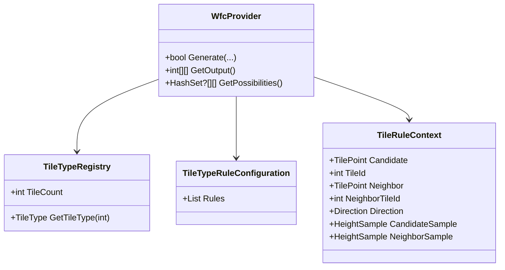

# Library Abstraction for Non-Tile Domains

## Overview

Document the current WFC implementation and clarify the path to abstraction for non-tile domains. The current codebase supports tile-based terrain generation only; generic domain support is a future goal.

## Table of contents

- [Overview](#overview)
- [Feature requirements](#feature-requirements)
- [Feature status](#feature-status)
- [Definition of terms](#definition-of-terms)
- [Architectural considerations and constraints](#architectural-considerations-and-constraints)
- [Implementation guide](#implementation-guide)

## Current Implementation

- WFC core is tightly coupled to tile-based terrain generation.
- All domains, rules, and propagation logic operate on tile IDs (`int`) and grid coordinates (`x, y`).
- The main entry point is `WfcProvider`, which exposes methods for chunk-sized grid solving, backtracking, and diagnostics.
- Rule evaluation is performed via `TileTypeRegistry`, `TileTypeRuleConfiguration`, and contextual inputs (height, biome, config).
- Propagation and constraint logic are not generic; all APIs expect tile IDs and terrain-specific context.

## Feature status

- Current: Tile/terrain-specific only
- Generic abstraction: Not started

## Definition of terms

| Term | Meaning | Reference |
| ---- | ------- | --------- |
| Term | Meaning | Reference |
| Domain | The set of possible tile IDs for a cell | [WfcProvider](../../../TerrainGeneration2D.Core/Mapping/WaveFunctionCollapse/WfcProvider.cs) |
| Adapter | (Planned) A component that would translate between generic and domain-specific logic | |

## Architectural considerations and constraints

### Current Constraints

- All code paths (domain, rule, propagation, output) are hardcoded for terrain tile IDs and grid coordinates.
- No generic interfaces for cell/value types; all APIs use `int` for tile IDs and `int x, int y` for coordinates.
- Rule evaluation is performed by terrain-specific classes (`TileType`, `TileTypeRegistry`, `TileRuleContext`).
- Propagation and backtracking are implemented for tile domains only.
- Diagnostics and performance counters are tied to terrain generation events.



## Implementation guide

### Extension Points

- To support non-tile domains, the following refactorings are required:
  - Introduce generic interfaces for domain, rule, and propagation logic (e.g., `IWfcSolver<TCell, TValue>`, `IRuleTable<TValue>`)
  - Decouple terrain-specific logic from the WFC core
  - Provide adapters for legacy terrain APIs
  - Ensure all tests and benchmarks for terrain generation pass after migration

### Planned Refactoring Steps

1. Refactor WFC core to use generic types for cells and values
2. Create generic configuration and rule table interfaces
3. Move terrain-specific logic to adapters
4. Update propagator and constraint logic to support generic domains
5. Provide sample adapters for non-tile domains (e.g., resource placement)

### Sample API (Current)

```csharp
// Terrain-only WFC API
var wfc = new WfcProvider(width, height, tileRegistry, randomProvider, tileTypeRuleConfig, heightProvider, chunkOrigin);
bool ok = wfc.Generate(enableBacktracking: true, maxIterations: 10000);
var output = wfc.GetOutput(); // int[][] of tile IDs
```

### Sample Generic API and Adapter (Planned)

```csharp
/// <summary>
/// Generic WFC solver interface for any constraint satisfaction domain.
/// </summary>
/// <typeparam name="TCell">Cell coordinate type (e.g., Point, Vector3)</typeparam>
/// <typeparam name="TValue">Value type placed in cells (e.g., int, enum)</typeparam>
public interface IWfcSolver<TCell, TValue>
{
    /// <summary>
    /// Solves the constraint satisfaction problem using WFC algorithm.
    /// </summary>
    /// <param name="config">Solver configuration and constraints</param>
    /// <returns>Solution if found; null if unsatisfiable within constraints</returns>
    WfcSolution<TCell, TValue>? Solve(WfcConfiguration<TCell, TValue> config);
}

/// <summary>
/// Generic rule table interface for WFC constraints.
/// </summary>
/// <typeparam name="TValue">Value type for which constraints are defined</typeparam>
public interface IRuleTable<TValue>
{
    /// <summary>
    /// Gets allowed neighboring values for a given value in a specific direction.
    /// </summary>
    /// <param name="value">The source value to check neighbors for</param>
    /// <param name="direction">The direction to check (North, South, East, West)</param>
    /// <returns>Enumeration of allowed neighboring values</returns>
    IEnumerable<TValue> GetAllowedNeighbors(TValue value, Direction direction);
}

/// <summary>
/// Generic configuration for WFC solver, holding settings, domains, and constraints.
/// </summary>
/// <typeparam name="TCell">Cell coordinate type</typeparam>
/// <typeparam name="TValue">Value type</typeparam>
public class WfcConfiguration<TCell, TValue>
{
    /// <summary>
    /// Gets or sets the initial domain for each cell (possible values).
    /// </summary>
    public IReadOnlyDictionary<TCell, ISet<TValue>> InitialDomains { get; set; }

    /// <summary>
    /// Gets or sets the rule table defining allowed neighbor relationships.
    /// </summary>
    public IRuleTable<TValue> RuleTable { get; set; }

    /// <summary>
    /// Gets or sets heuristic settings for cell selection.
    /// </summary>
    public HeuristicsConfiguration Heuristics { get; set; } = new HeuristicsConfiguration();

    /// <summary>
    /// Gets or sets the time budget for solving (in milliseconds).
    /// </summary>
    public int TimeBudgetMs { get; set; } = 50;
}

/// <summary>
/// Adapter for legacy tile-based WFC API, preserving backward compatibility.
/// </summary>
public class LegacyTileWfcAdapter : IWfcSolver<(int x, int y), int>
{
    private readonly WfcProvider _legacyProvider;

    /// <summary>
    /// Initializes a new instance of the LegacyTileWfcAdapter class.
    /// </summary>
    /// <param name="legacyProvider">The legacy WFC provider to adapt</param>
    public LegacyTileWfcAdapter(WfcProvider legacyProvider) => _legacyProvider = legacyProvider;

    /// <inheritdoc />
    /// <param name="config">Configuration for the WFC solve (may be partially used or ignored for legacy compatibility)</param>
    public WfcSolution<(int x, int y), int>? Solve(WfcConfiguration<(int x, int y), int> config)
    {
        // Bridge call to legacy provider
        var success = _legacyProvider.Generate();
        if (!success) return null;
        // Convert legacy output to generic solution
        // ...implementation omitted...
        // Example: Extract assignments from legacy provider's output
        var assignments = new Dictionary<(int x, int y), int>(); // Populate from legacy output
        return new WfcSolution<(int x, int y), int>(assignments);
    }
}
```

### Example usage: Resource placement in a grid (Planned)

```csharp
public void ResourcePlacementExample()
{
    // Define possible resources
    var resources = new[] { "Gold", "Wood", "Stone" };

    // Create configuration for a 10x10 grid
    var config = new WfcConfiguration<(int x, int y), string>
    {
        // ... set up domains, constraints, etc. ...
    };

    // Use a generic solver (could be a custom or built-in implementation)
    IWfcSolver<(int x, int y), string> solver = new ResourcePlacementAdapter();
    var solution = solver.Solve(config);
    // ... use solution for game logic ...
}
```

### Testing (Current)

- All tests and benchmarks are for terrain/tile domains only
- No generic domain tests exist yet

### Planned Generic Domain Tests

To validate generic WFC abstractions, the following test types should be implemented:

- **Unit tests** for generic solver interfaces:
    - Verify that `IWfcSolver<TCell, TValue>` can solve simple constraint satisfaction problems for arbitrary types (e.g., string, enum, custom class).
    - Test `IRuleTable<TValue>` for correct neighbor constraints in non-tile domains.

- **Integration tests** for adapters:
    - Validate that legacy adapters (e.g., `LegacyTileWfcAdapter`) produce the same output as the original terrain-specific implementation.
    - Test sample adapters for resource placement, building layouts, or other domains.

- **Property-based tests**:
    - Ensure that solutions always satisfy all constraints for randomly generated domains and rule tables.
    - Test determinism: given the same seed and configuration, the solver produces the same output.
    - Test completeness: all cells are assigned values from their domain, and no constraints are violated.

#### Example Test Sketches

```csharp
[Fact]
public void GenericSolver_SolvesSimpleDomain()
{
        // Arrange: create a simple domain and configuration
        var config = new WfcConfiguration<(int, int), string> { /* ... */ };
        var solver = new ResourcePlacementAdapter();
        // Act
        var solution = solver.Solve(config);
        // Assert
        Assert.NotNull(solution);
}

[Fact]
public void Adapter_ProducesSameOutput_AsLegacy()
{
        // Arrange: set up legacy provider and adapter
        var legacyProvider = new WfcProvider(/* ... */);
        var adapter = new LegacyTileWfcAdapter(legacyProvider);
        var config = new WfcConfiguration<(int x, int y), int> { /* ... */ };
        // Act
        var solution = adapter.Solve(config);
        // Assert
        // Compare output to known-good legacy result
}

[Property]
public void GenericSolver_AlwaysSatisfiesConstraints(/* ... */)
{
        // ... property-based test logic ...
}
```
