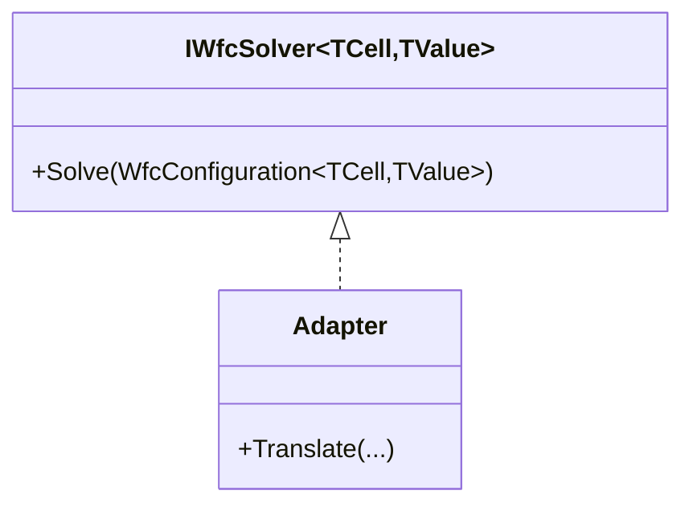

# Library Abstraction for Non-Tile Domains

## Overview

Abstract the WFC library to support non-tile domains, enabling procedural generation for a wide range of applications (e.g., building layouts, resource placement). Intended for teams needing WFC for domains beyond terrain tiles.

## Table of contents

- [Overview](#overview)
- [Feature requirements](#feature-requirements)
- [Feature status](#feature-status)
- [Definition of terms](#definition-of-terms)
- [Architectural considerations and constraints](#architectural-considerations-and-constraints)
- [Implementation guide](#implementation-guide)

## Feature requirements

- Generic WFC solver interfaces supporting arbitrary cell/value types
- Decouple terrain-specific logic from WFC core
- Support for custom rule and constraint systems
- Maintain performance and determinism

## Feature status

- Not started

## Definition of terms

| Term | Meaning | Reference |
| ---- | ------- | --------- |
| Domain | The set of possible values for a cell | |
| Adapter | A component that translates between generic and domain-specific logic | |

## Architectural considerations and constraints

- Backward compatibility for terrain generation
  - The generic WFC abstraction must preserve support for all existing terrain generation features and APIs.
  - Existing code using tile-based WFC (e.g., `WfcProvider`, `TileTypeRegistry`, `ChunkedTilemap`) should continue to work without modification.
  - Provide adapter classes or shims that map the legacy tile-based interfaces to the new generic interfaces.
  - Migration should be incremental: legacy and generic APIs can coexist, allowing gradual adoption.
  - All tests and benchmarks for terrain generation must pass after migration.
- Plugin system must support generic domains
- Test coverage for new abstractions



## Implementation guide

### Phase 1: Refactor WFC Core to Generics (Backward Compatibility Phase)

#### Objective

Refactor WFC core to use generic types for cells and values, while preserving backward compatibility for all existing terrain generation code and APIs.

#### Technical details

- Introduce generic types for cells and values in the WFC core interfaces and classes.
- Create a generic `WfcConfiguration<TCell, TValue>` class to hold solver settings, domains, and constraints.
- Refactor the rule table interface to use type parameters, creating `IRuleTable<TValue>`.
- Refactor existing non-generic classes (e.g., current `WfcConfiguration`, `IRuleTable`) to use generics or provide legacy adapters.
- Move terrain-specific logic to adapters, ensuring backward compatibility.

#### Examples

```csharp
/// <summary>
/// Generic WFC solver interface for any constraint satisfaction domain.
/// </summary>
/// <typeparam name="TCell">Cell coordinate type (e.g., Point, Vector3)</typeparam>
/// <typeparam name="TValue">Value type placed in cells (e.g., int, enum)</typeparam>
public interface IWfcSolver<TCell, TValue>
{
    /// <summary>
    /// Solves the constraint satisfaction problem using WFC algorithm.
    /// </summary>
    /// <param name="config">Solver configuration and constraints</param>
    /// <returns>Solution if found; null if unsatisfiable within constraints</returns>
    WfcSolution<TCell, TValue>? Solve(WfcConfiguration<TCell, TValue> config);
}

/// <summary>
/// Generic rule table interface for WFC constraints.
/// </summary>
/// <typeparam name="TValue">Value type for which constraints are defined</typeparam>
public interface IRuleTable<TValue>
{
    /// <summary>
    /// Gets allowed neighboring values for a given value in a specific direction.
    /// </summary>
    /// <param name="value">The source value to check neighbors for</param>
    /// <param name="direction">The direction to check (North, South, East, West)</param>
    /// <returns>Enumeration of allowed neighboring values</returns>
    IEnumerable<TValue> GetAllowedNeighbors(TValue value, Direction direction);
}

/// <summary>
/// Generic configuration for WFC solver, holding settings, domains, and constraints.
/// </summary>
/// <typeparam name="TCell">Cell coordinate type</typeparam>
/// <typeparam name="TValue">Value type</typeparam>
public class WfcConfiguration<TCell, TValue>
{
    /// <summary>
    /// Gets or sets the initial domain for each cell (possible values).
    /// </summary>
    public IReadOnlyDictionary<TCell, ISet<TValue>> InitialDomains { get; set; }

    /// <summary>
    /// Gets or sets the rule table defining allowed neighbor relationships.
    /// </summary>
    public IRuleTable<TValue> RuleTable { get; set; }

    /// <summary>
    /// Gets or sets heuristic settings for cell selection.
    /// </summary>
    public HeuristicsConfiguration Heuristics { get; set; } = new HeuristicsConfiguration();

    /// <summary>
    /// Gets or sets the time budget for solving (in milliseconds).
    /// </summary>
    public int TimeBudgetMs { get; set; } = 50;
}

/// <summary>
/// Adapter for legacy tile-based WFC API, preserving backward compatibility.
/// </summary>
public class LegacyTileWfcAdapter : IWfcSolver<(int x, int y), int>
{
    private readonly WfcProvider _legacyProvider;

    /// <summary>
    /// Initializes a new instance of the LegacyTileWfcAdapter class.
    /// </summary>
    /// <param name="legacyProvider">The legacy WFC provider to adapt</param>
    public LegacyTileWfcAdapter(WfcProvider legacyProvider) => _legacyProvider = legacyProvider;

    /// <inheritdoc />
    /// <param name="config">Configuration for the WFC solve (may be partially used or ignored for legacy compatibility)</param>
    public WfcSolution<(int x, int y), int>? Solve(WfcConfiguration<(int x, int y), int> config)
    {
        // Bridge call to legacy provider
        var success = _legacyProvider.Generate();
        if (!success) return null;
        // Convert legacy output to generic solution
        // ...implementation omitted...
        // Example: Extract assignments from legacy provider's output
        var assignments = new Dictionary<(int x, int y), int>(); // Populate from legacy output
        return new WfcSolution<(int x, int y), int>(assignments);
    }
}
```

The following test demonstrates that legacy terrain generation continues to work after migration to the generic WFC core. It verifies that the adapter correctly bridges the legacy and generic APIs and that the output is still valid.

```csharp
/// <summary>
/// Test: Legacy terrain generation still works after migration.
/// </summary>
[Fact]
public void LegacyTerrainGeneration_ProducesSameOutput_AfterMigration()
{
    // Arrange: set up legacy provider and config
    var legacyProvider = new WfcProvider(/* ... legacy args ... */);
    var adapter = new LegacyTileWfcAdapter(legacyProvider);
    var config = new WfcConfiguration<(int x, int y), int> { /* ... */ };
    // Act
    var solution = adapter.Solve(config);
    // Assert
    Assert.NotNull(solution);
    // Optionally compare output to known-good legacy result
}
```


```csharp
/// <summary>
/// Example usage: Resource placement in a grid.
/// </summary>
public void ResourcePlacementExample()
{
    // Define possible resources
    var resources = new[] { "Gold", "Wood", "Stone" };

    // Create configuration for a 10x10 grid
    var config = new WfcConfiguration<(int x, int y), string>
    {
        // ... set up domains, constraints, etc. ...
    };

    // Use a generic solver (could be a custom or built-in implementation)
    IWfcSolver<(int x, int y), string> solver = new ResourcePlacementAdapter();
    var solution = solver.Solve(config);
    // ... use solution for game logic ...
}
```

### Phase 2: Rule Table and Propagator Abstraction

#### Objective

Update the rule table and propagator to support generic constraints, enabling the WFC core to operate on any cell/value type, not just tile IDs.

#### Technical details

- Update the propagator (e.g., AC3Propagator) to work with generic domains and constraints.
- Provide adapters for terrain (legacy) and new non-tile domains.
- Ensure all constraint logic (adjacency, domain reduction) is type-agnostic and extensible.

#### Examples

```csharp
/// <summary>
/// Generic propagator for arc consistency.
/// </summary>
/// <typeparam name="TCell">Cell coordinate type</typeparam>
/// <typeparam name="TValue">Value type</typeparam>
public class GenericAC3Propagator<TCell, TValue>
{
    /// <summary>
    /// Propagates constraints from an observed cell and value.
    /// </summary>
    /// <param name="cell">The cell that was observed</param>
    /// <param name="observedValue">The value assigned to the cell</param>
    /// <param name="ruleTable">The rule table defining constraints</param>
    /// <returns>True if propagation succeeded without contradictions</returns>
    public bool PropagateFrom(TCell cell, TValue observedValue, IRuleTable<TValue> ruleTable, /* ... */)
    {
        // ... generic propagation logic ...
        return true;
    }
}
```

### Phase 3: Sample Implementations and Documentation

#### Objective

Demonstrate the flexibility of the generic WFC library by providing sample implementations for non-tile domains and updating onboarding documentation.


#### Technical details

- Implement at least one sample adapter for resource placement (e.g., resources as values).
- Document the process of creating a new domain adapter, including required interfaces and configuration.
- Update onboarding and API documentation to include generic usage patterns and migration guides.

#### Examples

```csharp
using System;
using System.Linq;
using System.Collections.Generic;
using JohnLudlow.MonoGameSamples.TerrainGeneration2D.Core.Mapping.ResourceTypes;

public static class ResourceTypeIds
{
    public const int Void = 0;
    public const int Stone = 1;
    public const int Wood = 2;
    public const int Gold = 3;
    public const int Metal = 4;
}

public abstract class ResourceType
{
    protected ResourceType(int resourceId, string name)
    {
        ResourceId = resourceId;
        Name = name;
    }

    public int ResourceId { get; }
    public string Name { get; }

    // Optionally, add rules for resource placement
    public abstract bool EvaluateRules(ResourceRuleContext context);
}

public sealed class StoneResource : ResourceType
{
    public StoneResource() : base(ResourceTypeIds.Stone, "Stone") { }
    public override bool EvaluateRules(ResourceRuleContext context) => true;
}

public sealed class WoodResource : ResourceType
{
    public WoodResource() : base(ResourceTypeIds.Wood, "Wood") { }
    public override bool EvaluateRules(ResourceRuleContext context) => true;
}

public sealed class GoldResource : ResourceType
{
    public GoldResource() : base(ResourceTypeIds.Gold, "Gold") { }
    public override bool EvaluateRules(ResourceRuleContext context) => true;
}

public sealed class MetalResource : ResourceType
{
    public MetalResource() : base(ResourceTypeIds.Metal, "Metal") { }
    public override bool EvaluateRules(ResourceRuleContext context) => true;
}

public sealed class ResourceTypeRegistry
{
    private readonly Dictionary<int, ResourceType> _resourceTypes;
    private readonly List<int> _resourceOrder;

    public ResourceTypeRegistry(IEnumerable<ResourceType> resourceTypes)
    {
        _resourceTypes = resourceTypes.ToDictionary(r => r.ResourceId);
        _resourceOrder = resourceTypes.Select(r => r.ResourceId).ToList();
    }

    public ResourceType GetResourceType(int resourceId)
    {
        if (!_resourceTypes.TryGetValue(resourceId, out var resourceType))
        {
            throw new InvalidOperationException($"Resource type {resourceId} is not registered.");
        }
        return resourceType;
    }

    public int ResourceCount => _resourceOrder.Count;
    public IReadOnlyList<int> ResourceIds => _resourceOrder;

    public static ResourceTypeRegistry CreateDefault()
    {
        var resourceTypes = new List<ResourceType>
        {
            new StoneResource(),
            new WoodResource(),
            new GoldResource(),
            new MetalResource()
        };
        return new ResourceTypeRegistry(resourceTypes);
    }
}

public class IntResourceRuleTable : IRuleTable<int>
{
    private readonly IReadOnlyList<int> _resourceIds;
    public IntResourceRuleTable(ResourceTypeRegistry registry)
    {
        _resourceIds = registry.ResourceIds;
    }
    public IEnumerable<int> GetAllowedNeighbors(int value, Direction direction)
    {
        // All resources allowed as neighbors
        return _resourceIds;
    }
}

public class ResourcePlacementAdapter : IWfcSolver<(int x, int y), int>
{
    public WfcSolution<(int x, int y), int>? Solve(WfcConfiguration<(int x, int y), int> config)
    {
        var assignments = new Dictionary<(int x, int y), int>();
        foreach (var cell in config.InitialDomains.Keys)
        {
            var domain = config.InitialDomains[cell];
            if (domain.Count > 0)
            {
                assignments[cell] = domain.First();
            }
        }
        return new WfcSolution<(int x, int y), int>(assignments);
    }
}
```

### Phase 4: Testing

#### Objective

Ensure correctness, robustness, and maintainability of the generic WFC abstractions through comprehensive testing.

#### Technical details

- Add unit tests for the generic solver interface and core algorithm logic.
- Create integration tests for each sample non-tile domain adapter (e.g., building layouts, resource placement).
- Implement property-based tests to verify constraint satisfaction, determinism, and completeness across arbitrary domains.
- Validate backward compatibility with terrain generation through regression tests.

#### Examples

```csharp

    /// <summary>
    /// Unit test for generic WFC solver.
    /// </summary>
    [Fact]
    public void GenericSolver_SolvesSimpleDomain()
    {
        // Arrange: create a simple domain and configuration
        var config = new WfcConfiguration<(int, int), string> { /* ... */ };
        var solver = new ResourcePlacementAdapter();
        // Act
        var solution = solver.Solve(config);
        // Assert
        Assert.NotNull(solution);
    }

/// <summary>
/// Property-based test for constraint satisfaction.
/// </summary>
[Property]
public void GenericSolver_AlwaysSatisfiesConstraints(/* ... */)
{
    // ... property-based test logic ...
}
```
