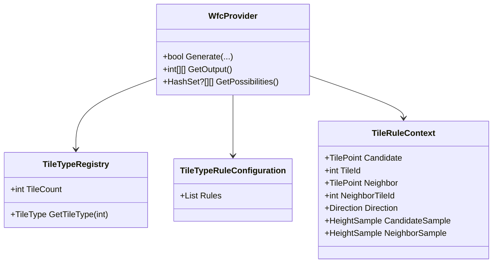

# Library Abstraction for Non-Tile Domains

## Overview

Document the current WFC implementation and clarify the path to abstraction for non-tile domains. The current codebase supports tile-based terrain generation only; generic domain support is a future goal.

## Table of contents

- [Overview](#overview)
- [Plan issue](#plan-issue)
- [Plan status](#plan-status)
- [Definition of terms](#definition-of-terms)
- [Architectural considerations and constraints](#architectural-considerations-and-constraints)
- [Implementation guide](#implementation-guide)
  - [Plan requirements](#plan-requirements)
- [See also](#see-also)
- [References](#references)

## Plan issue

This plan is tracked by GitHub issue [#12][issue-12]:

- **Library Abstraction for Non-Tile Domains**
- Part of [WFC Completion Plan][parent-plan] Phase 4

See [meta issue #22][issue-22] for overall WFC completion tracking.

## Plan status

- Not started
- Generic abstraction: Not started

### Current Implementation

The current WFC implementation is tightly coupled to tile-based terrain generation:

- All domains, rules, and propagation logic operate on tile IDs (`int`) and grid coordinates (`x, y`).
- The main entry point is `WfcProvider`, which exposes methods for chunk-sized grid solving, backtracking, and diagnostics.
- Rule evaluation is performed via `TileTypeRegistry`, `TileTypeRuleConfiguration`, and contextual inputs (height, biome, config).
- Propagation and constraint logic are not generic; all APIs expect tile IDs and terrain-specific context.

## Definition of terms

| Term    | Meaning                                                                              | Reference                                                                                    |
| ------- | ------------------------------------------------------------------------------------ | -------------------------------------------------------------------------------------------- |
| Adapter | (Planned) A component that would translate between generic and domain-specific logic |                                                                                              |
| Domain  | The set of possible tile IDs for a cell                                              | [WfcProvider](../../../TerrainGeneration2D.Core/Mapping/WaveFunctionCollapse/WfcProvider.cs) |

## Architectural considerations and constraints

### Current Constraints

- All code paths (domain, rule, propagation, output) are hardcoded for terrain tile IDs and grid coordinates.
- No generic interfaces for cell/value types; all APIs use `int` for tile IDs and `int x, int y` for coordinates.
- Rule evaluation is performed by terrain-specific classes (`TileType`, `TileTypeRegistry`, `TileRuleContext`).
- Propagation and backtracking are implemented for tile domains only.
- Diagnostics and performance counters are tied to terrain generation events.


```mermaid
classDiagram
    class WfcProvider {
        +bool Generate(...)
        +int[][] GetOutput()
        +HashSet<int>?[][] GetPossibilities()
    }
    class TileTypeRegistry {
        +TileType GetTileType(int)
        +int TileCount
    }
    class TileTypeRuleConfiguration {
        +List<GroupRuleConfiguration> Rules
    }
    class TileRuleContext {
        +TilePoint Candidate
        +int TileId
        +TilePoint Neighbor
        +int NeighborTileId
        +Direction Direction
        +HeightSample CandidateSample
        +HeightSample NeighborSample
    }
    WfcProvider --> TileTypeRegistry
    WfcProvider --> TileTypeRuleConfiguration
    WfcProvider --> TileRuleContext
```

## Implementation guide

### Plan requirements

- (***COMPLETE***) Generic WFC solver interfaces support arbitrary cell/value types
  - GIVEN a need to support non-tile domains
  - WHEN the WFC solver is used for a new domain
  - THEN it must accept generic cell and value types

- (Incomplete) Decouple terrain-specific logic from WFC core
  - GIVEN the current WFC implementation
  - WHEN refactoring for generic support
  - THEN all terrain-specific logic is moved to adapters or shims

> Implementation not started. See Phase 1 below.

- (Incomplete) Support for custom rule and constraint systems
  - GIVEN a new domain with unique constraints
  - WHEN configuring the WFC solver
  - THEN custom rule and constraint systems can be injected or implemented

> Implementation not started. See Phase 2 below.

- (Incomplete) Maintain performance and determinism
  - GIVEN the generic WFC implementation
  - WHEN running on large or complex domains
  - THEN performance and determinism are not degraded compared to the legacy implementation

> Implementation not started. See Phase 4 below.

### Extension Points

- To support non-tile domains, the following refactorings are required:
  - Introduce generic interfaces for domain, rule, and propagation logic (e.g., `IWfcSolver<TCell, TValue>`, `IRuleTable<TValue>`)
  - Decouple terrain-specific logic from the WFC core
  - Provide adapters for legacy terrain APIs
  - Ensure all tests and benchmarks for terrain generation pass after migration

#### Objective

### Planned Refactoring Steps

1. Refactor WFC core to use generic types for cells and values
2. Create generic configuration and rule table interfaces
3. Move terrain-specific logic to adapters
4. Update propagator and constraint logic to support generic domains
5. Provide sample adapters for non-tile domains (e.g., resource placement)

### Sample API (Current)

```csharp
// Terrain-only WFC API
var wfc = new WfcProvider(width, height, tileRegistry, randomProvider, tileTypeRuleConfig, heightProvider, chunkOrigin);
bool ok = wfc.Generate(enableBacktracking: true, maxIterations: 10000);
var output = wfc.GetOutput(); // int[][] of tile IDs
```

### Sample Generic API and Adapter (Planned)

#### Phase requirements

- (Incomplete) Refactor core to generics
  - GIVEN the current WFC core
  - WHEN refactoring begins
  - THEN all core types and methods use generics for cell/value

> Implementation not started. See technical details above.

- (Incomplete) Provide legacy adapters/shims
  - GIVEN legacy APIs (WfcProvider, TileTypeRegistry)
  - WHEN generic core is available
  - THEN adapters/shims allow legacy code to work unchanged

> Implementation not started. See technical details above.

- (Incomplete) Preserve test/benchmark coverage
  - GIVEN migration to generics
  - WHEN tests and benchmarks are run
  - THEN all legacy terrain tests/benchmarks pass

> Implementation not started. See technical details above.

#### Examples

```csharp
/// <summary>
/// Generic WFC solver interface for any constraint satisfaction domain.
/// </summary>
/// <typeparam name="TCell">Cell coordinate type (e.g., Point, Vector3)</typeparam>
/// <typeparam name="TValue">Value type placed in cells (e.g., int, enum)</typeparam>
public interface IWfcSolver<TCell, TValue>
{
    /// <summary>
    /// Solves the constraint satisfaction problem using WFC algorithm.
    /// </summary>
    /// <param name="config">Solver configuration and constraints</param>
    /// <returns>Solution if found; null if unsatisfiable within constraints</returns>
    WfcSolution<TCell, TValue>? Solve(WfcConfiguration<TCell, TValue> config);
}

/// <summary>
/// Generic rule table interface for WFC constraints.
/// </summary>
/// <typeparam name="TValue">Value type for which constraints are defined</typeparam>
public interface IRuleTable<TValue>
{
    /// <summary>
    /// Gets allowed neighboring values for a given value in a specific direction.
    /// </summary>
    /// <param name="value">The source value to check neighbors for</param>
    /// <param name="direction">The direction to check (North, South, East, West)</param>
    /// <returns>Enumeration of allowed neighboring values</returns>
    IEnumerable<TValue> GetAllowedNeighbors(TValue value, Direction direction);
}

/// <summary>
/// Generic configuration for WFC solver, holding settings, domains, and constraints.
/// </summary>
/// <typeparam name="TCell">Cell coordinate type</typeparam>
/// <typeparam name="TValue">Value type</typeparam>
public class WfcConfiguration<TCell, TValue>
{
    /// <summary>
    /// Gets or sets the initial domain for each cell (possible values).
    /// </summary>
    public IReadOnlyDictionary<TCell, ISet<TValue>> InitialDomains { get; set; }

    /// <summary>
    /// Gets or sets the rule table defining allowed neighbor relationships.
    /// </summary>
    public IRuleTable<TValue> RuleTable { get; set; }

    /// <summary>
    /// Gets or sets heuristic settings for cell selection.
    /// </summary>
    public HeuristicsConfiguration Heuristics { get; set; } = new HeuristicsConfiguration();

    /// <summary>
    /// Gets or sets the time budget for solving (in milliseconds).
    /// </summary>
    public int TimeBudgetMs { get; set; } = 50;
}

/// <summary>
/// Adapter for legacy tile-based WFC API, preserving backward compatibility.
/// </summary>
public class LegacyTileWfcAdapter : IWfcSolver<(int x, int y), int>
{
    private readonly WfcProvider _legacyProvider;

    /// <summary>
    /// Initializes a new instance of the LegacyTileWfcAdapter class.
    /// </summary>
    /// <param name="legacyProvider">The legacy WFC provider to adapt</param>
    public LegacyTileWfcAdapter(WfcProvider legacyProvider) => _legacyProvider = legacyProvider;

    /// <inheritdoc />
    /// <param name="config">Configuration for the WFC solve (may be partially used or ignored for legacy compatibility)</param>
    public WfcSolution<(int x, int y), int>? Solve(WfcConfiguration<(int x, int y), int> config)
    {
        // Bridge call to legacy provider
        var success = _legacyProvider.Generate();
        if (!success) return null;
        // Convert legacy output to generic solution
        // ...implementation omitted...
        // Example: Extract assignments from legacy provider's output
        var assignments = new Dictionary<(int x, int y), int>(); // Populate from legacy output
        return new WfcSolution<(int x, int y), int>(assignments);
    }
}
```

### Example usage: Resource placement in a grid (Planned)

```csharp
public void ResourcePlacementExample()
{
    // Define possible resources
    var resources = new[] { "Gold", "Wood", "Stone" };

    // Create configuration for a 10x10 grid
    var config = new WfcConfiguration<(int x, int y), string>
    {
        // ... set up domains, constraints, etc. ...
    };

    // Use a generic solver (could be a custom or built-in implementation)
    IWfcSolver<(int x, int y), string> solver = new ResourcePlacementAdapter();
    var solution = solver.Solve(config);
    // ... use solution for game logic ...
}
```

### Testing (Current)

**Phase status:** Not started

#### Objective

### Planned Generic Domain Tests

To validate generic WFC abstractions, the following test types should be implemented:

- **Unit tests** for generic solver interfaces:
  - Verify that `IWfcSolver<TCell, TValue>` can solve simple constraint satisfaction problems for arbitrary types (e.g., string, enum, custom class).
  - Test `IRuleTable<TValue>` for correct neighbor constraints in non-tile domains.

#### Phase requirements

- (Incomplete) Refactor rule table to generics
  - GIVEN the legacy rule table
  - WHEN refactoring for generics
  - THEN rule table supports any cell/value type

> Implementation not started. See technical details above.

- (Incomplete) Refactor propagator to generics
  - GIVEN the legacy propagator
  - WHEN refactoring for generics
  - THEN propagator supports any cell/value type

> Implementation not started. See technical details above.

- (Incomplete) Provide adapters for legacy/new domains
  - GIVEN generic rule table/propagator
  - WHEN supporting terrain and new domains
  - THEN adapters allow both legacy and new domains to work

> Implementation not started. See technical details above.

#### Examples

```csharp
/// <summary>
/// Generic rule table interface for WFC constraints.
/// </summary>
public interface IRuleTable<TCell, TValue>
{
    /// <summary>
    /// Gets allowed neighboring values for a given value in a specific direction.
    /// </summary>
    IEnumerable<TValue> GetAllowedNeighbors(TValue value, Direction direction);
}

/// <summary>
/// Generic propagator for arc consistency.
/// </summary>
public class GenericAC3Propagator<TCell, TValue>
{
    public bool PropagateFrom(TCell cell, TValue observedValue, IRuleTable<TCell, TValue> ruleTable, /* ... */)
    {
        // ... generic propagation logic ...
        return true;
    }
}
```

### Phase 3: Sample Implementations and Documentation

**Phase status:** Not started

#### Objective

Demonstrate the flexibility of the generic WFC library by providing sample implementations for non-tile domains and updating onboarding documentation.

#### Technical details

- Implement at least two sample adapters: one for building layouts (e.g., rooms as values), one for resource placement (e.g., resources as values).
- Document the process of creating a new domain adapter, including required interfaces and configuration.
- Update onboarding and API documentation to include generic usage patterns and migration guides.

#### Phase requirements

- (Incomplete) Implement sample adapters
  - GIVEN the generic WFC core
  - WHEN creating sample adapters
  - THEN at least two non-tile domain adapters are implemented

> Implementation not started. See technical details above.

- (Incomplete) Document adapter creation process
  - GIVEN the need for new domain adapters
  - WHEN onboarding new developers
  - THEN documentation explains how to create adapters and configure them

> Implementation not started. See technical details above.

- (Incomplete) Update onboarding/API docs
  - GIVEN migration to generics
  - WHEN updating documentation
  - THEN onboarding/API docs include generic usage and migration guides

> Implementation not started. See technical details above.

#### Examples

```csharp
/// <summary>
/// Adapter for WFC-based building layout generation.
/// </summary>
public class BuildingLayoutAdapter : IWfcSolver<(int x, int y), string>
{
    public WfcSolution<(int x, int y), string>? Solve(WfcConfiguration<(int x, int y), string> config)
    {
        // Example: Use WFC to generate a building layout with room types as strings
        // ...implementation omitted...
        return null;
    }
}

/// <summary>
/// Adapter for WFC-based resource placement.
/// </summary>
public class ResourcePlacementAdapter : IWfcSolver<(int x, int y), string>
{
    public WfcSolution<(int x, int y), string>? Solve(WfcConfiguration<(int x, int y), string> config)
    {
        // Example: Use WFC to place resources on a grid
        // ...implementation omitted...
        return null;
    }
}
```

### Phase 4: Testing

**Phase status:** Not started

#### Objective

Ensure correctness, robustness, and maintainability of the generic WFC abstractions through comprehensive testing.

#### Technical details

- Add unit tests for the generic solver interface and core algorithm logic.
- Create integration tests for each sample non-tile domain adapter (e.g., building layouts, resource placement).
- Implement property-based tests to verify constraint satisfaction, determinism, and completeness across arbitrary domains.
- Validate backward compatibility with terrain generation through regression tests.

#### Phase requirements

- (Incomplete) Add unit tests for generic solver/core
  - GIVEN the generic solver/core
  - WHEN writing unit tests
  - THEN all core logic is covered by unit tests

> Implementation not started. See technical details above.

- (Incomplete) Add integration tests for adapters
  - GIVEN sample adapters
  - WHEN writing integration tests
  - THEN all sample adapters are covered by integration tests

> Implementation not started. See technical details above.

- (Incomplete) Add property-based tests for constraints/determinism/completeness
  - GIVEN arbitrary domains
  - WHEN running property-based tests
  - THEN constraint satisfaction, determinism, and completeness are verified

> Implementation not started. See technical details above.

- (Incomplete) Validate backward compatibility with terrain
  - GIVEN migration to generics
  - WHEN running regression tests
  - THEN terrain generation remains correct and performant

> Implementation not started. See technical details above.

#### Examples

```csharp
/// <summary>
/// Unit test for generic WFC solver.
/// </summary>
[Fact]
public void GenericSolver_SolvesSimpleDomain()
{
        // Arrange: create a simple domain and configuration
        var config = new WfcConfiguration<(int, int), string> { /* ... */ };
        var solver = new ResourcePlacementAdapter();
        // Act
        var solution = solver.Solve(config);
        // Assert
        Assert.NotNull(solution);
}

[Fact]
public void Adapter_ProducesSameOutput_AsLegacy()
{
        // Arrange: set up legacy provider and adapter
        var legacyProvider = new WfcProvider(/* ... */);
        var adapter = new LegacyTileWfcAdapter(legacyProvider);
        var config = new WfcConfiguration<(int x, int y), int> { /* ... */ };
        // Act
        var solution = adapter.Solve(config);
        // Assert
        // Compare output to known-good legacy result
}

[Property]
public void GenericSolver_AlwaysSatisfiesConstraints(/* ... */)
{
        // ... property-based test logic ...
}
```

## See also

### Parent Plan

- **[WFC Completion Plan][parent-plan]** - Master implementation plan for WFC completion

### Related Child Plans

- **[Plugin Architecture][child-plugin]** - Phase 4: Pluggable provider system for WFC extensibility
- **[Performance Analysis][child-performance]** - Phase 3: Optimization strategies and caching architecture
- **[Property Testing][child-testing]** - Phase 5: Comprehensive property-based and performance regression tests

### Related Documentation

- **[WFC Algorithm Overview][doc-wfc]** - Core WFC algorithm explanation
- **[Architecture Class Diagram][doc-architecture]** - System architecture overview

### GitHub Tracking

- **This Plan**: [Issue #12][issue-12] - Library Abstraction for Non-Tile Domains
- **Meta Issue**: [#22 - WFC Implementation Completion][issue-22]

### Implementation Files

- **[WfcProvider.cs][impl-wfcprovider]** - Current tile-based WFC implementation
- **[TileTypeRegistry.cs][impl-registry]** - Tile type management (domain-specific)
- **[ChunkedTilemap.cs][impl-tilemap]** - Tilemap integration with WFC

## References

### Wave Function Collapse

- **[WFC Original Paper][ref-wfc-original]** - Maxim Gumin's original WFC algorithm
- **[WFC Explanation][ref-wfc-explained]** - Robert Heaton's WFC tutorial

### Generic Programming

- **[C# Generics][ref-csharp-generics]** - Microsoft documentation on C# generics
- **[Generic Algorithms in .NET][ref-generic-algorithms]** - Best practices for generic algorithm design

### Adapter Pattern

- **[Adapter Pattern][ref-adapter]** - Gang of Four design pattern
- **[Refactoring to Generics][ref-refactoring-generics]** - Martin Fowler on refactoring to generics

### Testing

- **[Property-Based Testing][ref-pbt]** - Introduction to property-based testing
- **[FsCheck][ref-fscheck]** - F# property testing library for .NET

<!-- Link References -->

<!-- GitHub Issues -->
[issue-12]: https://github.com/JohnLudlow/MonoGameSamples.TerrainGeneration2D/issues/12
[issue-22]: https://github.com/JohnLudlow/MonoGameSamples.TerrainGeneration2D/issues/22

<!-- Plans -->
[parent-plan]: ../wfc-completion-plan.md
[child-plugin]: plugin-architecture.md
[child-performance]: performance-analysis.md
[child-testing]: property-and-performance-tests.md

<!-- Documentation -->
[doc-wfc]: ../../map-generation/wfc/README.md
[doc-architecture]: ../../architecture-class-diagram.md

<!-- Implementation Files -->
[impl-wfcprovider]: ../../../TerrainGeneration2D.Core/Mapping/WfcProvider.cs
[impl-registry]: ../../../TerrainGeneration2D.Core/Mapping/TileTypeRegistry.cs
[impl-tilemap]: ../../../TerrainGeneration2D.Core/Graphics/ChunkedTilemap.cs

<!-- External References -->
[ref-wfc-original]: https://github.com/mxgmn/WaveFunctionCollapse
[ref-wfc-explained]: https://robertheaton.com/2018/12/17/wavefunction-collapse-algorithm/
[ref-csharp-generics]: https://learn.microsoft.com/en-us/dotnet/csharp/fundamentals/types/generics
[ref-generic-algorithms]: https://learn.microsoft.com/en-us/dotnet/standard/generics/
[ref-adapter]: https://refactoring.guru/design-patterns/adapter
[ref-refactoring-generics]: https://martinfowler.com/articles/refactoring-generics.html
[ref-pbt]: https://hypothesis.works/articles/what-is-property-based-testing/
[ref-fscheck]: https://fscheck.github.io/FsCheck/
