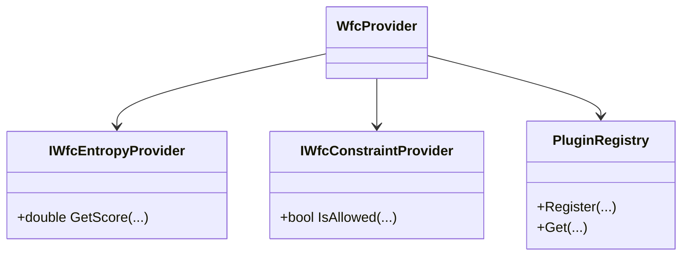

# Plugin Architecture for WFC

## Overview

Enable a plugin architecture for the Wave Function Collapse (WFC) system, allowing pluggable entropy and constraint providers. This supports extensibility, custom strategies, and runtime selection without modifying the WFC core. Intended for teams needing custom heuristics or domain logic.

## Table of contents

- [Overview](#overview)
- [Feature requirements](#feature-requirements)
- [Feature status](#feature-status)
- [Definition of terms](#definition-of-terms)
- [Architectural considerations and constraints](#architectural-considerations-and-constraints)
- [Implementation guide](#implementation-guide)

## Feature requirements

### Feature requirements

- (Incomplete) Support for custom entropy providers (cell selection heuristics)
  - GIVEN a need for custom cell selection
  - WHEN a plugin is registered and selected
  - THEN the WFC system uses the custom entropy provider

> Implementation not started. See Implementation guide Phase 1.

- (Incomplete) Support for custom constraint providers (adjacency, domain restrictions)
  - GIVEN a need for custom adjacency or domain rules
  - WHEN a plugin is registered and selected
  - THEN the WFC system uses the custom constraint provider

> Implementation not started. See Implementation guide Phase 1.

- (Incomplete) Runtime selection and configuration of plugins
  - GIVEN multiple plugins are available
  - WHEN the user selects a plugin at runtime or via config
  - THEN the WFC system uses the selected plugin without restart

> Implementation not started. See Implementation guide Phase 3/4.

- (Incomplete) Backward compatibility with existing WFC configuration
  - GIVEN existing WFC configuration files and code
  - WHEN the plugin system is enabled
  - THEN existing configurations continue to work without modification

> Implementation not started. See Implementation guide Phase 2.

- (Incomplete) Minimal performance overhead for plugin dispatch
  - GIVEN the plugin system is in use
  - WHEN running WFC generation
  - THEN plugin dispatch does not introduce significant overhead

> Implementation not started. See Implementation guide Phase 2/5.

## Feature status

- Not started

## Definition of terms

| Term | Meaning | Reference |
| ---- | ------- | --------- |
| Entropy Provider | Component that selects the next cell to observe in WFC | |
| Constraint Provider | Component that enforces adjacency or domain rules | |
| Plugin | Dynamically loaded or registered component implementing a WFC interface | |

## Architectural considerations and constraints

- Plugins must be thread-safe and deterministic
- Plugin API must be documented and stable
- Minimal runtime overhead for plugin dispatch
- Plugins must be usable in both editor and runtime environments



## Implementation guide

### Phase 1: Define Plugin Interfaces

#### Objective

Define interfaces for entropy and constraint providers.

#### Technical details

Create `IWfcEntropyProvider` and `IWfcConstraintProvider` interfaces. Document required methods and expected behavior.

#### Examples

```csharp
/// <summary>
/// Interface for entropy provider plugins.
/// </summary>
public interface IWfcEntropyProvider {
    double GetScore(int x, int y, HashSet<int>?[][] domains, int[][] output, WfcWeightConfiguration config);
}

/// <summary>
/// Interface for constraint provider plugins.
/// </summary>
public interface IWfcConstraintProvider {
    bool IsAllowed(int tileId, int neighborId, Direction dir);
}

/// <summary>
/// Example plugin: Always returns a fixed score for entropy.
/// </summary>
public class FixedEntropyProvider : IWfcEntropyProvider {
    public double GetScore(int x, int y, HashSet<int>?[][] domains, int[][] output, WfcWeightConfiguration config) => 1.0;
}

/// <summary>
/// Example plugin: Only allows even tile IDs next to each other.
/// </summary>
public class EvenTileConstraintProvider : IWfcConstraintProvider {
    public bool IsAllowed(int tileId, int neighborId, Direction dir) => tileId % 2 == neighborId % 2;
}
```

The following test demonstrates that a custom entropy provider plugin can be registered and used by the WFC system. It verifies that the plugin registry and selection mechanism work as intended.

```csharp
/// <summary>
/// Test: Plugin registry selects and uses a custom entropy provider.
/// </summary>
[Fact]
public void PluginRegistry_UsesCustomEntropyProvider()
{
    // Arrange
    var registry = new PluginRegistry();
    registry.Register<IWfcEntropyProvider>("fixed", new FixedEntropyProvider());
    var provider = registry.Get<IWfcEntropyProvider>("fixed");
    // Act
    var score = provider.GetScore(0, 0, null, null, null);
    // Assert
    Assert.Equal(1.0, score);
}
```

This test shows that a custom constraint provider plugin can be registered and used, enforcing a specific adjacency rule.

```csharp
/// <summary>
/// Test: Plugin registry uses custom constraint provider.
/// </summary>
[Fact]
public void PluginRegistry_UsesCustomConstraintProvider()
{
    // Arrange
    var registry = new PluginRegistry();
    registry.Register<IWfcConstraintProvider>("even", new EvenTileConstraintProvider());
    var provider = registry.Get<IWfcConstraintProvider>("even");
    // Act & Assert
    Assert.True(provider.IsAllowed(2, 4, Direction.North));
    Assert.False(provider.IsAllowed(2, 3, Direction.North));
}
```

### Phase 2: Refactor WFC Core

#### Objective

Refactor the WFC core to use plugin interfaces for entropy and constraint logic, enabling runtime extensibility and custom strategies.

#### Technical details

- Replace all direct calls to built-in entropy and constraint logic with interface-based calls.
- Allow injection of plugins via constructor, configuration, or service locator.
- Ensure the WFC core can fall back to default built-in logic if no plugin is provided.
- Update all relevant code paths (cell selection, constraint checks) to use the plugin interfaces.

#### Examples

```csharp
// In WfcProvider or similar:
private IWfcEntropyProvider _entropyProvider;
private IWfcConstraintProvider _constraintProvider;

public WfcProvider(IWfcEntropyProvider entropyProvider, IWfcConstraintProvider constraintProvider)
{
    _entropyProvider = entropyProvider;
    _constraintProvider = constraintProvider;
}

// Usage:
var score = _entropyProvider.GetScore(x, y, _domains, _output, _config);
if (_constraintProvider.IsAllowed(tileId, neighborId, dir)) { /* ... */ }
```

### Phase 3: Plugin Registry and Discovery

#### Objective

Implement a registry for plugin discovery, registration, and selection, supporting both static and dynamic plugin loading.

#### Technical details

- Create a `PluginRegistry` class to register, retrieve, and enumerate plugins by name, type, or metadata.
- Support registration of plugins at startup, via configuration, or at runtime (e.g., via reflection or MEF).
- Allow plugins to be discovered from assemblies or loaded dynamically if required.
- Provide APIs for listing available plugins and selecting the active plugin for each interface.
- Support runtime configuration and hot-swapping of plugins if needed.

#### Examples

```csharp
public class PluginRegistry
{
    private readonly Dictionary<string, object> _plugins = new();
    public void Register<T>(string name, T plugin) => _plugins[name] = plugin;
    public T Get<T>(string name) => (T)_plugins[name];
    public IEnumerable<string> List<T>() => _plugins.Where(p => p.Value is T).Select(p => p.Key);
}
```

### Phase 4: Configuration and UI

#### Objective

Enable users to select and configure plugins at runtime via the UI and configuration files, supporting both developer and end-user workflows.

#### Technical details

- Expose available plugins in the F10 runtime settings panel or equivalent UI.
- Allow users to select the active entropy and constraint provider plugins from the list of registered plugins.
- Persist plugin selections in appsettings.json or user settings.
- Support hot-reloading or switching plugins without restarting the application if feasible.
- Provide clear error messages and fallbacks if a selected plugin is unavailable.

#### Examples

```json
// appsettings.json
{
    "WfcPlugins": {
        "EntropyProvider": "fixed",
        "ConstraintProvider": "even"
    }
}
```

```csharp
// In the F10 panel UI logic:
// List available plugins and allow selection
var entropyPlugins = pluginRegistry.List<IWfcEntropyProvider>().ToList();
var constraintPlugins = pluginRegistry.List<IWfcConstraintProvider>().ToList();

// Display dropdowns for user selection (pseudo-UI code)
string selectedEntropy = ShowDropdown("Entropy Provider", entropyPlugins, currentEntropySelection);
string selectedConstraint = ShowDropdown("Constraint Provider", constraintPlugins, currentConstraintSelection);

// On selection, update the registry and persist the choice
pluginRegistry.SetActive<IWfcEntropyProvider>(selectedEntropy);
pluginRegistry.SetActive<IWfcConstraintProvider>(selectedConstraint);
SaveToAppSettings("WfcPlugins:EntropyProvider", selectedEntropy);
SaveToAppSettings("WfcPlugins:ConstraintProvider", selectedConstraint);
```

### Phase 5: Testing

#### Objective

Ensure the plugin system is robust, correct, and supports all intended extensibility scenarios, including error handling and fallback logic.

#### Technical details

- Add unit tests for plugin interface contracts (e.g., required methods, expected behaviors).
- Create integration tests for plugin registration, selection, and execution in the WFC core.
- Implement property-based tests to verify plugin correctness across a range of inputs.
- Test error handling for missing, invalid, or misconfigured plugins.
- Validate that fallback to built-in logic works if a plugin is not available.

#### Examples

```csharp
// See earlier test snippets for plugin registration and usage.
// Additional test: fallback logic
/// <summary>
/// Test: WFC core falls back to built-in logic if plugin is missing.
/// </summary>
[Fact]
public void WfcProvider_FallsBackToBuiltInLogic_WhenPluginMissing()
{
    // Arrange: do not register a plugin
    var provider = new WfcProvider(null, null); // null means use built-in
    // Act
    var result = provider.RunWfc();
    // Assert
    Assert.NotNull(result);
    // ... further assertions ...
}
```
